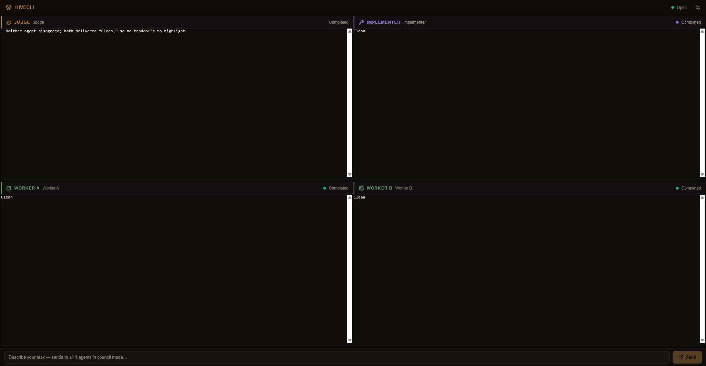

# HiveCLI

HiveCLI is a local-first desktop workspace for running multiple CLI-backed agents in parallel, watching their output live, and chaining them through a lightweight council flow.

The current MVP is optimized for a 4-panel Codex CLI workflow:

- Worker A
- Worker B
- Judge
- Implementer

The app fans one prompt out to the workers, waits for them to settle, asks the judge to synthesize, then passes that verdict into the implementer for the final answer.

## Screenshot



## What Works Today

- One-command local startup with `pnpm start`
- Live multi-agent streaming over WebSockets
- PTY-backed CLI agents via `node-pty`
- Saved sessions and replay from local SQLite
- Codex CLI templates with automatic migration for older agent configs
- Council pipeline: workers -> judge -> implementer
- Settings page for local provider and workspace defaults

## Stack

- Desktop shell: Tauri 2
- Frontend: React, TypeScript, Vite, Tailwind CSS
- Runtime state: Zustand + React Query
- Terminal rendering: xterm.js
- Orchestrator: Node.js, TypeScript, Express, WebSockets
- Process runtime: node-pty
- Persistence: SQLite via Node `node:sqlite`
- Shared contracts: Zod + `packages/shared`

## Monorepo Layout

```text
apps/
  desktop/       Tauri shell + React UI
  orchestrator/  local sidecar server, PTY runtime, persistence
packages/
  shared/        shared types, schemas, constants, council helpers
docs/
  screenshots/   README assets
```

## Getting Started

### Requirements

- Node 22 to 25
- pnpm 10+
- Windows-first environment for the current MVP
- Rust only if you want to run the Tauri shell directly
- Installed and authorized CLI backends such as `codex`

### Install

```powershell
pnpm install
```

If `node-pty` needs a local rebuild on your machine:

```powershell
pnpm rebuild node-pty
```

### Run

```powershell
pnpm start
```

That launcher:

- starts the orchestrator if it is not already running on `127.0.0.1:45231`
- reuses it if it is already up
- starts the frontend on `http://localhost:1420`
- exits cleanly if both services are already running

PowerShell launcher:

```powershell
.\Start-HiveCLI.ps1
```

If you have Rust/Tauri installed:

```powershell
pnpm run start:tauri
```

## Testing

From the repo root:

```powershell
pnpm typecheck
pnpm --filter @hive/orchestrator test
pnpm test:ui
pnpm build
```

`pnpm test:ui` runs the Playwright smoke flow against the live app.

## Built-In Agent Templates

- `Codex CLI`
- `Gemini CLI`
- `Custom CLI`

Current Codex default:

```text
codex exec --full-auto -m gpt-5.1-codex-mini -c model_reasoning_effort=medium "{{prompt}}"
```

## Persistence

Default local database path:

```text
apps/orchestrator/data/hivecli.db
```

Tracked repo files do not include the local database, runtime logs, or saved local session artifacts.

## Current Caveats

- The development path is still sidecar-style: the orchestrator runs separately from the Tauri shell during local dev.
- This MVP is terminal-first. Direct OpenAI, Anthropic, and Gemini API adapters are not implemented yet.
- `node:sqlite` works here on Node 25, but it is still marked experimental upstream.
- `codex` behavior and supported model slugs depend on the local CLI version and auth mode.

## Roadmap

- Direct API-backed LLM adapters
- Tauri-bundled orchestrator startup
- Layout persistence and drag/drop panel management
- Safer approval gates for risky CLI actions
- Git-aware workflows and richer task chaining

## License

No license file is included yet.
