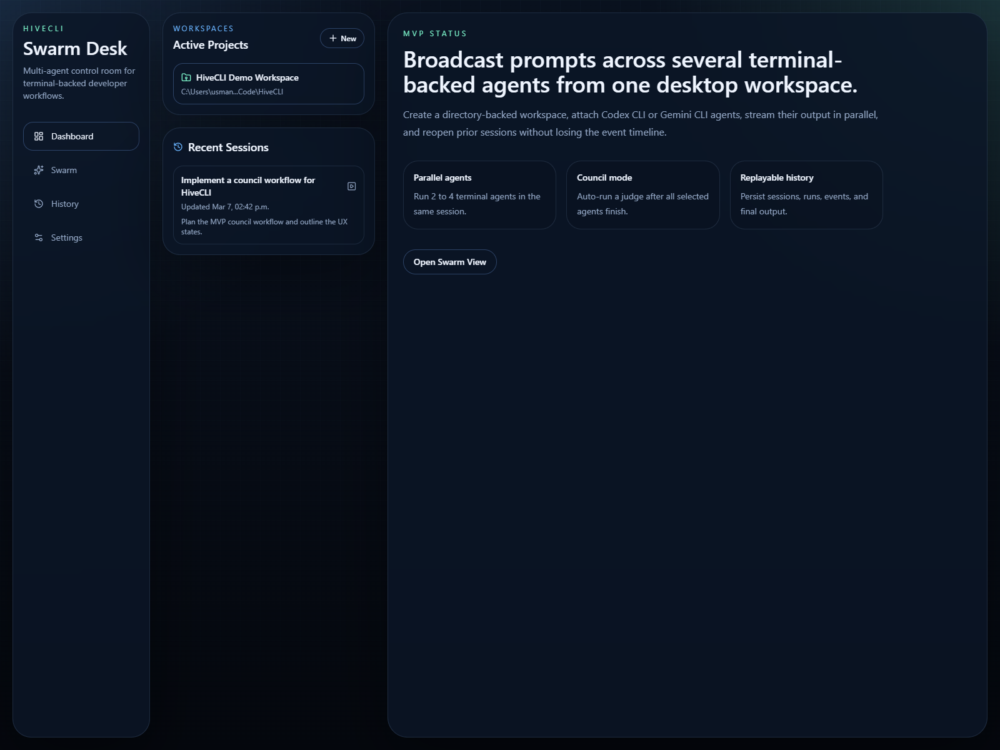
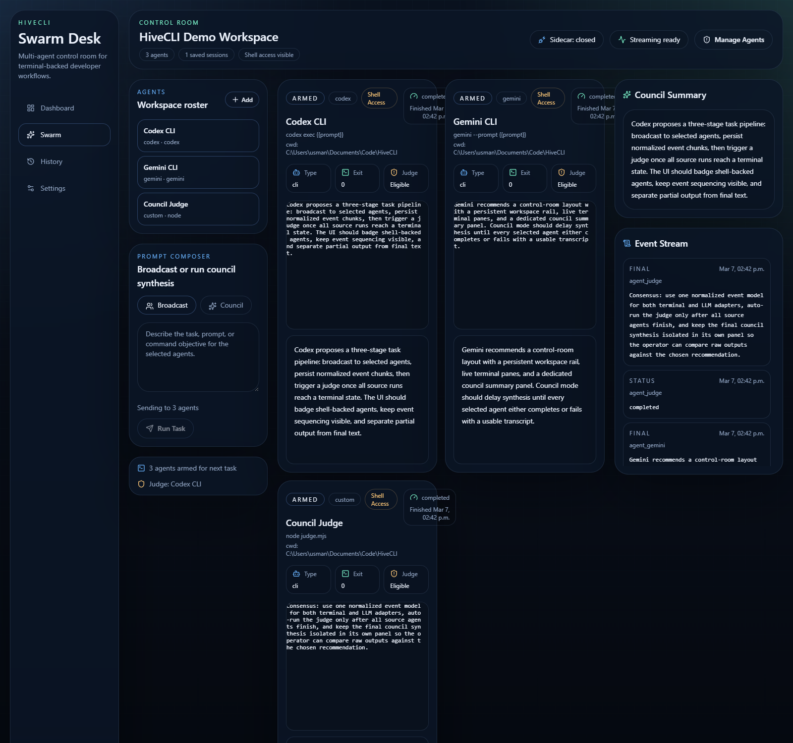
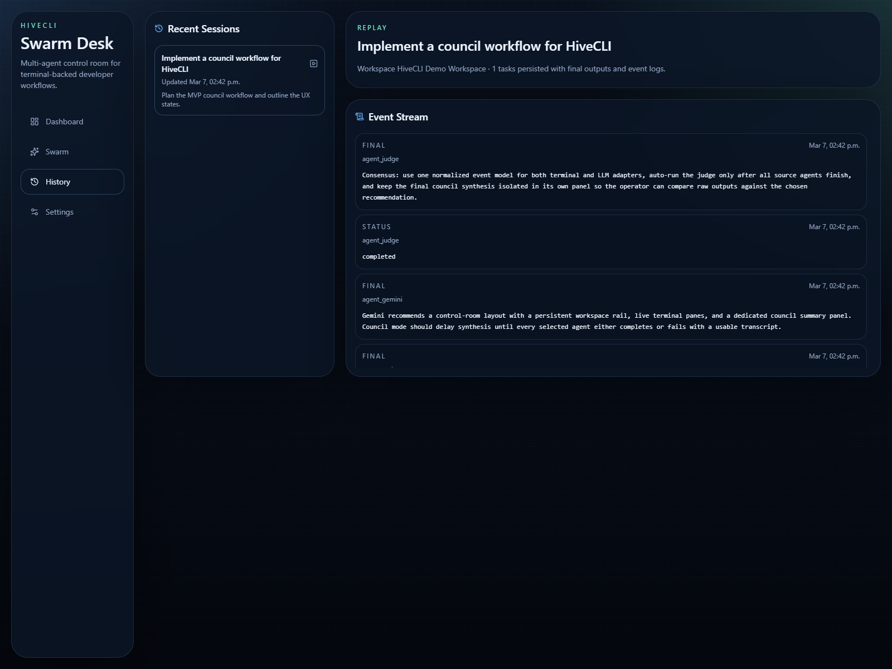
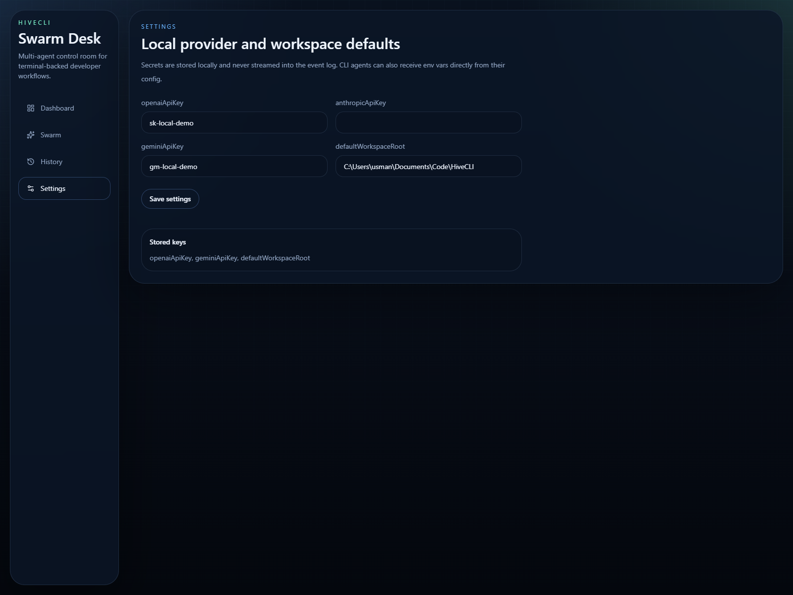
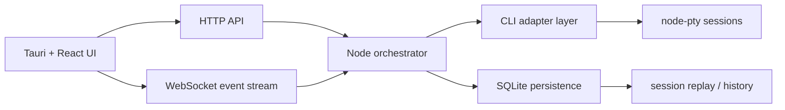

# HiveCLI

HiveCLI is a local-first desktop control room for running several CLI-backed agents in parallel inside one workspace.

The MVP focuses on:

- multi-agent task orchestration
- live streamed output
- side-by-side comparison
- council/judge synthesis
- saved sessions and replay
- a desktop-first developer UX

## Screenshots

### Dashboard



### Swarm View



### Session History



### Settings



## What The MVP Does

- Create directory-backed workspaces.
- Add several CLI-backed agents to each workspace.
- Broadcast one prompt to multiple agents at once.
- Stream each agent into its own panel.
- Mark judge-capable agents and run council synthesis after source agents finish.
- Persist workspaces, sessions, tasks, runs, messages, events, and settings in SQLite.
- Reopen prior sessions and inspect final outputs plus the event timeline.

## Stack

- Desktop shell: Tauri 2
- Frontend: React, TypeScript, Vite, Tailwind CSS
- UI primitives: shadcn-style components
- Terminal rendering: xterm.js
- Orchestrator: Node.js, TypeScript, Express, WebSockets
- CLI process runtime: node-pty
- Persistence: SQLite
- Validation and shared contracts: Zod

## Architecture



## Monorepo Layout

```text
apps/
  desktop/       Tauri shell + React UI
  orchestrator/  local sidecar server, PTY runtime, persistence
packages/
  shared/        shared types, schemas, constants, council helpers
docs/
  screenshots/   README assets
```

## Current Flow

1. Start the local orchestrator.
2. Start the desktop frontend.
3. Create or open a workspace.
4. Add 2 to 4 agents.
5. Run a `broadcast` task or `council` task.
6. Watch each pane stream independently.
7. Reopen the saved session later from History or Dashboard.

## Getting Started

### Requirements

- Node 22 to 25
- pnpm 10+
- Rust toolchain for the Tauri shell
- Windows-first environment for the current MVP

### Install

```powershell
pnpm install
pnpm approve-builds
pnpm rebuild better-sqlite3 node-pty esbuild
```

Approve the native builds for `better-sqlite3`, `node-pty`, and `esbuild` when prompted.

### Run The App

Fastest path on Windows:

```powershell
.\Start-HiveCLI.ps1
```

That starts the orchestrator first, waits for it to become ready on `127.0.0.1:45231`, then launches the frontend on `http://localhost:1420`.

You can also use:

```powershell
pnpm start
```

If Rust/Tauri is installed and you want the desktop shell:

```powershell
.\Start-HiveCLI.ps1 -Tauri
```

or:

```powershell
pnpm run start:tauri
```

Manual startup is still available:

Start the orchestrator:

```powershell
pnpm --filter @hive/orchestrator dev
```

In a second terminal, start the frontend:

```powershell
pnpm --filter @hive/desktop dev
```

Then open [http://localhost:1420](http://localhost:1420).

If Rust/Tauri is installed, you can also run the desktop shell:

```powershell
pnpm --filter @hive/desktop dev:tauri
```

## Test Commands

From the repo root:

```powershell
pnpm typecheck
pnpm build
pnpm --filter @hive/orchestrator test
```

## Built-In Agent Templates

- `Codex CLI`
- `Gemini CLI`
- `Custom CLI`

The CLI adapter supports prompt interpolation in commands and args via:

- `{{prompt}}`
- `{{sessionId}}`
- `{{taskId}}`
- `{{workspaceRoot}}`

## Persistence

The default local database path is:

```text
apps/orchestrator/data/hivecli.db
```

This stores:

- workspaces
- agents
- sessions
- tasks
- agent runs
- messages
- events
- settings

## Current MVP Caveats

- Tauri runtime config is wired in, but automatic sidecar spawning is not finished yet.
- The initial adapter runtime is terminal-first. Direct OpenAI, Anthropic, and Gemini API adapters are not implemented in this slice.
- Native dependencies still need to be built locally for your current Node installation.

## Notes For Testing

- If `codex` or `gemini` are installed on your `PATH`, you can use the built-in templates directly.
- If they are not installed, create a `Custom CLI` agent pointed at a simple local script or command that reads stdin and writes stdout.
- Council mode excludes the judge from source-agent fan-out and runs the judge after all source runs settle.

## Roadmap After MVP

- real API-backed LLM adapters
- orchestrator sidecar spawning from Tauri
- layout persistence and drag-and-drop panes
- diffing and git-aware workflows
- approval gates for risky CLI actions
- richer workflow chaining and templates

## License

No license file is included yet.
